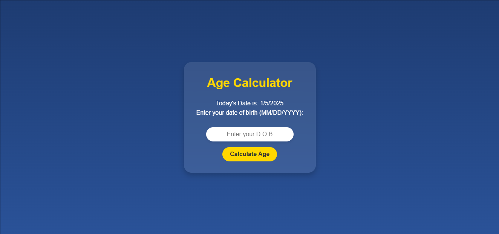

# 🎉 Welcome to the Age Calculator 🖐

A simple yet effective **JavaScript project** that calculates your age in years. It’s a great way to understand basic DOM manipulation and date handling in JavaScript!

---

## 🌟 Default View

Below are screenshots of the **Default View** and the **Result View** after calculating age:

| Default View                        | Result View                        |
|-------------------------------------|------------------------------------|
|       |          |

---

## 💻 Tech Stack

This project is built using the following technologies:


---

## 🚀 How to Use:

Follow the steps below to get started with the **Age Calculator**:

1. Clone the repository:
   ```bash
   git clone https://github.com/Rochdi7/Web-Mini-Projects
