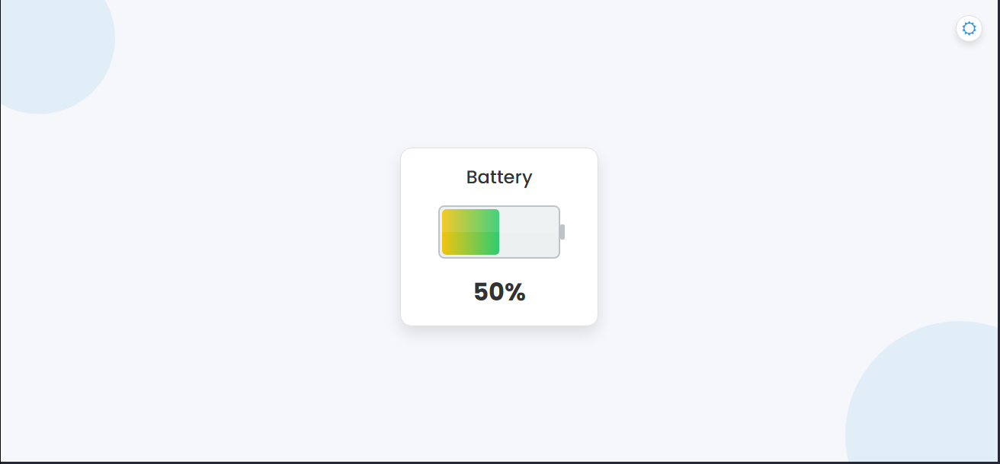
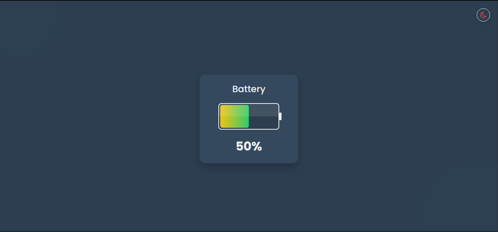

# ⚡ Modern Battery Indicator

A sleek and interactive **battery indicator** with a modern design and smooth theme toggling. This project is perfect for showcasing battery levels or integrating into applications that require a visual battery status display. Enjoy a clean, flat-design look that adapts beautifully to both light and dark themes!

---

## 🌟 Default View

Below are some screenshots of the **Modern Battery Indicator** in both light and dark modes:

| Light Mode                                   | Dark Mode                                   |
|----------------------------------------------|---------------------------------------------|
|  |  |


---

## 💻 Tech Stack

This project is built using the following technologies:


---

## 🚀 How to Use

Follow the steps below to get started with the **Modern Battery Indicator**:

1. **Clone the repository:**
   ```bash
   git clone https://github.com/Rochdi7/Web-Mini-Projects/modern-battery-indicator.git
   ```

2. **Navigate to the project directory:**
   ```bash
   cd modern-battery-indicator
   ```

3. **Open `index.html` in your favorite browser** to see the battery indicator in action.

---

## 📜 Features

- **Modern Design:**  
  Clean, flat-design look with smooth gradients and subtle shadows.
- **Interactive Theme Toggle:**  
  Switch effortlessly between light and dark modes.
- **Responsive Layout:**  
  Optimized to look great on all devices.
- **Easy Customization:**  
  Update the battery level dynamically with a simple JavaScript adjustment.

---

## ✨ Future Improvements

You can enhance this project further by adding:

- **Dynamic Battery Updates:**  
  Integrate with real battery status APIs or simulate live updates.
- **Customization Options:**  
  Allow users to choose different color themes or gradient styles.
- **Enhanced Animations:**  
  Include animations that respond to battery level changes for a more engaging experience.

---

## 🤝 Contributing

Contributions are always welcome! If you’d like to improve this project, follow these steps:

1. **Fork the repository.**
2. **Create a new branch** for your feature or bug fix:
   ```bash
   git checkout -b feature/your-feature-name
   ```
3. **Commit your changes**:
   ```bash
   git commit -m "Add some feature"
   ```
4. **Push to your branch**:
   ```bash
   git push origin feature/your-feature-name
   ```
5. **Open a pull request** on GitHub.

---

## 📢 License

This project is licensed under the **MIT License** - see the [LICENSE](LICENSE) file for details.

---

## 📬 Contact

For any inquiries or feedback, feel free to reach out:

- **Email:** rochdi.karouali1234@gmail.com
- **GitHub:** [@Rochdi7](https://github.com/Rochdi7)

---

## ⭐ Support

If you enjoy this project, please give it a star on GitHub! Your support inspires me to create more awesome projects. Happy coding! ⚡

---

Enjoy your Modern Battery Indicator!
