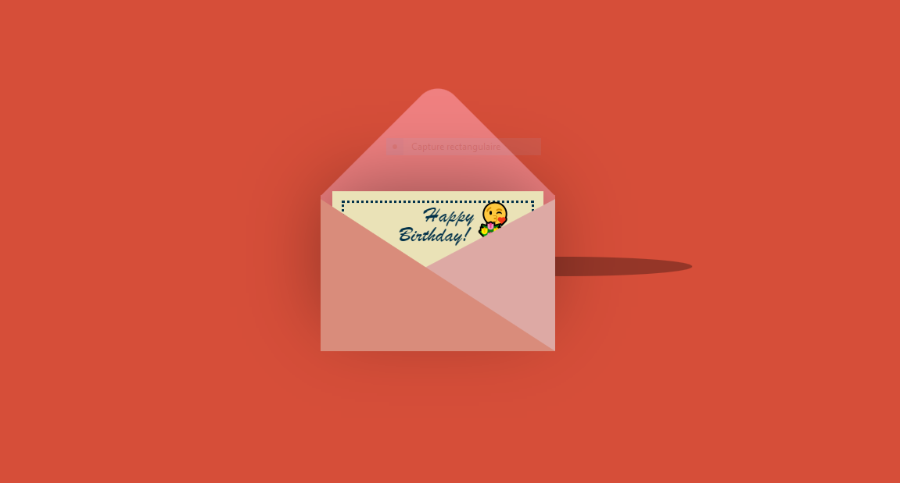
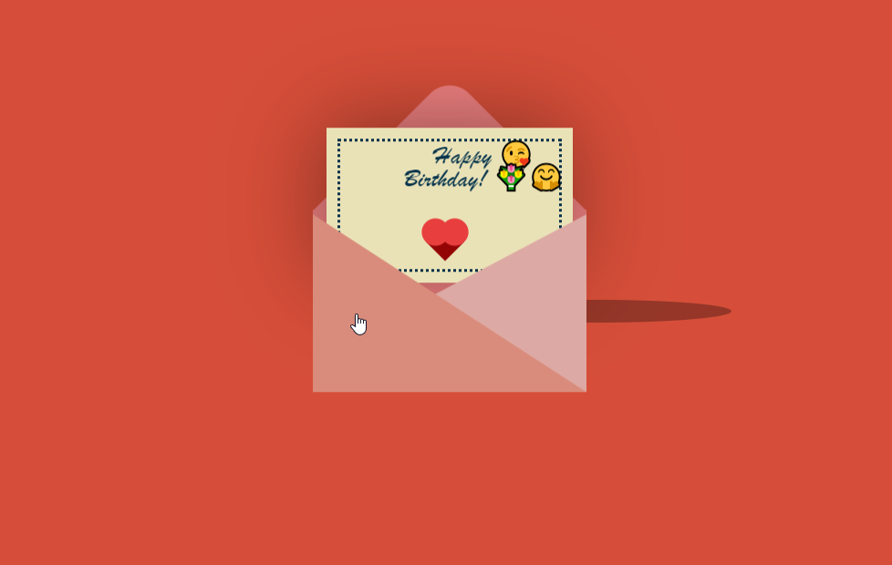

# 💌 Welcome to the Birthday Letter Envelope Animation 🎂

A beautiful and interactive **envelope animation** that opens to reveal a hidden birthday message. Perfect for celebrating birthdays or special occasions! 🎉✨

---

## 🌟 Default View

Below are screenshots of the **Closed Envelope** and the **Opened Envelope** after interacting with the animation:

| Closed Envelope                      | Opened Envelope                        |
|--------------------------------------|----------------------------------------|
|      |        |

---

## 💻 Tech Stack

This project is built using the following technologies:


---

## 🚀 How to Use:

Follow the steps below to get started with the **Birthday Letter Envelope Animation**:

1. Clone the repository:
   ```bash
   git clone https://github.com/Rochdi7/Web-Mini-Projects.git

📜 Features
Smooth animations using CSS for a delightful effect.
Interactive design with jQuery for animating the envelope.
Responsive layout that works on all devices. 📱💻
Customizable message and design to add a personal touch. 🎨
✨ Future Improvements
You can improve this project by adding:

Sound effects when the envelope opens. 🔊
Allow users to input their own birthday message. ✍️
Create a backend to save and share custom messages. 🌐
🤝 Contributing
Contributions are always welcome! If you’d like to improve this project, feel free to open a pull request:

Fork the repository.
Create a new branch.
Make your changes.
Push to your fork and submit a pull request.
📢 License
This project is licensed under the MIT License - see the LICENSE file for details.

📬 Contact
For any inquiries, feel free to contact me:

Email: rochdi.karouali1234@gmail.com
GitHub: @Rochdi7
⭐️ Support
If you like this project, please give it a star on GitHub! ⭐️
Your support motivates me to create more awesome projects. 😊

Enjoy the project! 🎉
Happy Coding! 💻✨