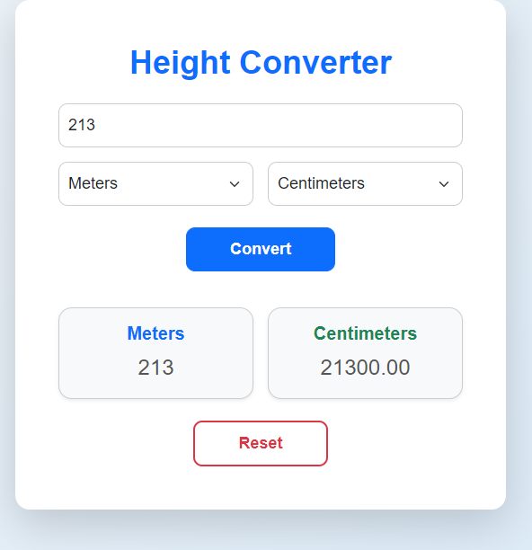

# 🌟 Height Converter Project

A sleek and modern **Height Converter** application that allows users to easily convert between different units of height (e.g., Centimeters, Inches, Meters, Kilometers, Miles). The project focuses on user-friendly design and clean code implementation.

---

## 🚀 Features

- **Dynamic Conversions**: Converts height between units with precision.
- **Responsive Design**: Adapts seamlessly to all devices (desktop, tablet, mobile).
- **Stylish UI/UX**: Designed with modern aesthetics and usability in mind.
- **Interactive Output**: Displays the converted values dynamically in real-time.

---

## 📂 Project Structure

```plaintext
📁 height-converter/
├── 📄 index.html     # HTML structure
├── 📄 style.css      # Styling and UI design
├── 📄 script.js      # Conversion logic
├── 📄 README.md      # Project documentation
└── 📄 result.png     # Screenshot of the app
```

---

## 🛠️ Setup Instructions

1. **Clone the repository:**
   ```bash
   git clone https://github.com/Rochdi7/Web-Mini-Projects
   cd height-converter
   ```

2. **Open the application in a browser:**
   ```bash
   open index.html
   ```

---

## 💻 Demo

Here’s what the application looks like:



---

## 🧑‍💻 Technologies Used

- **HTML5**: For structuring the web content.
- **CSS3**: For styling and responsiveness.
- **JavaScript**: For dynamic behavior and logic.
- **Bootstrap**: For responsive layout and components.

---

## 🌟 Contribution

We welcome contributions! If you'd like to improve this project, feel free to:

1. Fork the repository.
2. Create a new branch.
3. Submit a pull request.

---

## 📝 License

This project is licensed under the MIT License. Feel free to use it as you wish.

---

## 🛠️ Author

Developed by **Rochdi** ❤️.
