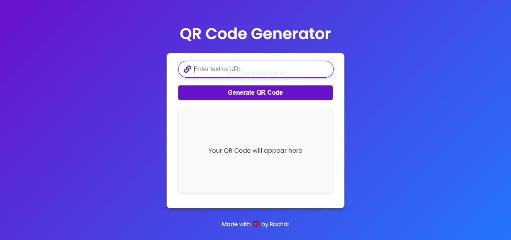
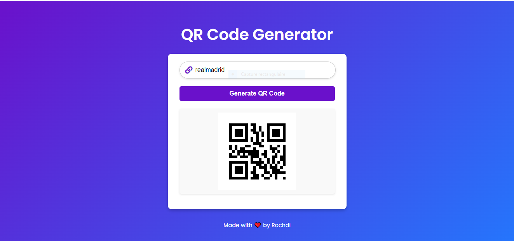

# QR Code Generator 🌟

A sleek and modern **QR Code Generator** built with **HTML**, **CSS**, and **JavaScript**. This project allows users to input text or a URL and instantly generate a QR code.

---

## 🖼️ Screenshots

### Input Interface


### Generated QR Code


---

## 🚀 Features

- 🔗 **Dynamic QR Code Generation**: Enter any text or URL to generate a QR code instantly.
- 🎨 **Modern and Stylish Design**: Sleek input field, buttons, and overall UI/UX.
- ⚡ **Responsive Layout**: Fully responsive design for mobile and desktop devices.
- 💾 **Lightweight**: Minimal dependencies for fast performance.

---

## 🛠️ Technologies Used

- **HTML5**: Structure of the web page.
- **CSS3**: Styling and animations.
- **JavaScript**: Logic for generating QR codes.
- [**QRCode.js**](https://github.com/davidshimjs/qrcodejs): Library used for QR code generation.

---

## 📂 File Structure

```
project-folder/
├── index.html          # Main HTML file
├── script.js           # JavaScript file for QR code logic
├── style.css           # Optional additional CSS (inline styles already included)
├── 1.png               # Screenshot of the input interface
├── result.png          # Screenshot of the generated QR code
└── README.md           # Project documentation
```

---

## 🎉 Getting Started

1. Clone the repository or download the project folder.
   ```bash
   git clone https://github.com/your-repo/qr-code-generator.git
   cd qr-code-generator
   ```

2. Open `index.html` in your browser to use the QR Code Generator.

---

## 📖 How to Use

1. Open the application in your browser.
2. Enter the text or URL into the input field.
3. Click on the **Generate QR Code** button.
4. The QR code will appear below the button!

---

## 🔧 Future Enhancements

- ✅ Add a download button to save the QR code as an image.
- 🎨 Customize QR code colors.
- 🌐 Host the project online using GitHub Pages or Netlify.

---

## 📄 License

This project is licensed under the MIT License. Feel free to use, modify, and distribute it as you like!
