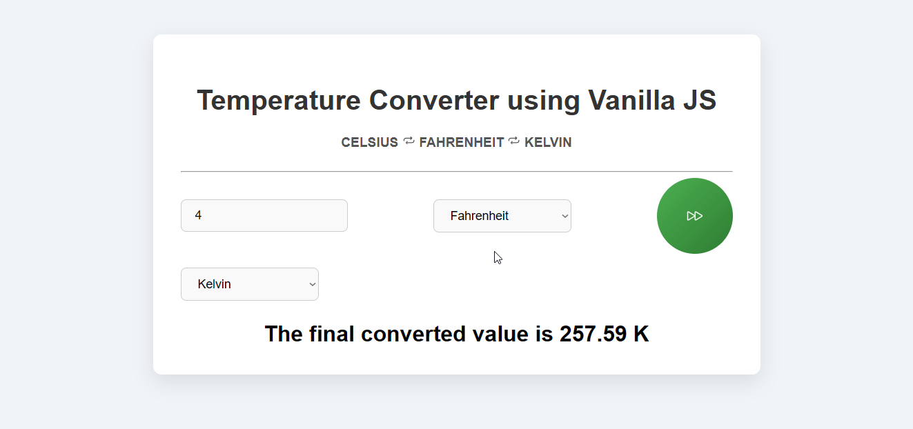
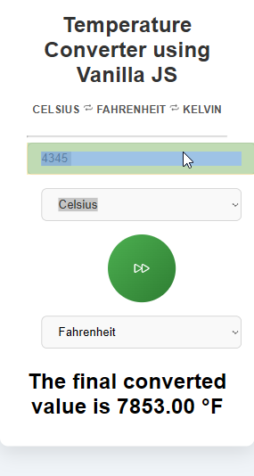

# 🎉 Welcome to the Temperature Converter 🌡️

A simple yet effective **JavaScript project** that converts temperatures between **Celsius**, **Fahrenheit**, and **Kelvin**. It’s a great way to practice DOM manipulation, event handling, and temperature conversions in JavaScript!

---

## 🌟 Default View

Below are screenshots of the **Default View** and the **Result View** after converting the temperature:

| Default View                        | Result View                        |
|-------------------------------------|------------------------------------|
|        |       |

---

## 💻 Tech Stack

This project is built using the following technologies:


---

## 🚀 How to Use:

Follow the steps below to get started with the **Temperature Converter**:

1. Clone the repository:
   ```bash
   git clone https://github.com/Rochdi7/temperature-converter.git


📜 Features
Temperature Conversion: Convert between Celsius, Fahrenheit, and Kelvin.
Responsive Design: Built with Bootstrap to ensure a clean, mobile-friendly UI.
Modern UI: Clean, user-friendly interface with interactive icons.
✨ Future Enhancements
You can improve this project by adding:

Support for additional temperature scales (e.g., Rankine).
A dark/light mode toggle for the UI.
A real-time temperature API to fetch the current temperature of a location.
🤝 Contributing
Contributions are always welcome! If you’d like to improve this project, feel free to open a pull request:

Fork the repository.
Create a new branch.
Make your changes.
Push to your fork and submit a pull request.

📢 License:
This project is licensed under the MIT License - see the LICENSE file for details.

📬 Contact:
For any inquiries, feel free to contact me:

Email: rochdi.karouali1234@gmail.com
GitHub: @Rochdi7

Happy Converting! 🌟 EOL