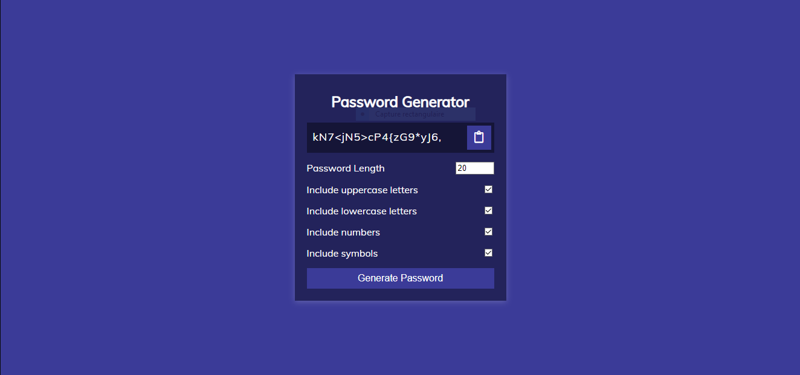

# Password Generator

A sleek and modern **Password Generator** application built using **HTML**, **CSS**, and **JavaScript**.

---

## 🚀 Features

- 🔒 **Customizable Options**:
  - Set password length (4 to 20 characters)
  - Include uppercase letters
  - Include lowercase letters
  - Include numbers
  - Include symbols
- 📋 **Copy to Clipboard**:
  - Quickly copy the generated password with a single click.

---

## 🎨 Preview



---

## 🛠️ Installation

1. Clone this repository to your local machine:
   ```bash
   git clone https://github.com/Rochdi7/Web-Mini-Projects
   cd password-generator
   ```
2. Ensure you have an active internet connection for Font Awesome icons.

---

## 📖 Usage

1. Open the `index.html` file in your favorite web browser.
2. Customize the password settings according to your requirements.
3. Click the **Generate Password** button to create a strong, random password.
4. Use the clipboard icon to copy the password instantly.

---

## 📂 Project Structure

```
password-generator/
├── index.html     # Main HTML file
├── style.css      # Styling for the application
├── index.js       # JavaScript logic for password generation
├── Capture.PNG    # Screenshot of the application
```

---

## 🖼️ Screenshot

Here’s a glimpse of the **Password Generator**:


---

## 📜 License

This project is licensed under the **MIT License**. Feel free to use, modify, and distribute it as per the license terms.

---

## 💡 Contributions

Contributions are welcome! If you find a bug or have a feature request, feel free to create an issue or submit a pull request.
