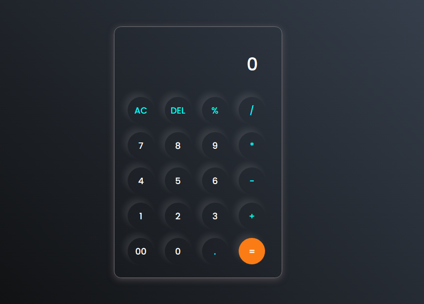

# 📌 Dark Mode Calculator  



A stylish and modern **Dark Mode Calculator** featuring a **sleek Neumorphic UI**, built with **HTML, CSS, and JavaScript**.

---

## ✨ Features

✔ **Elegant Neumorphism Design** 🎨  
✔ **Dark Mode Aesthetic** 🌙  
✔ **Smooth Button Hover Effects** 🖱  
✔ **Basic Arithmetic Operations** ➕➖✖➗  
✔ **Responsive Design for All Devices** 📱💻  

---

## 🔧 Tech Stack

- **HTML** - Structure of the Calculator  
- **CSS** - Custom Neumorphic Styling  
- **JavaScript** - Functional Logic  

---

## 📸 Preview


---

## 🚀 Getting Started

### 1️⃣ Clone the Repository

```sh
git clone https://github.com/Rochdi7/Web-Mini-Projects
```

### 2️⃣ Open in Browser

Simply open **index.html** in your favorite browser.

---

## 🖌 Customization

You can modify the `style.css` file to adjust:
- **Button Colors**
- **Neumorphic Depth**
- **Hover Effects**
- **Font Style**

---

## 💡 Upcoming Features

- [ ] **Scientific Calculator Functions** 🧮  
- [ ] **History Feature** ⏳  
- [ ] **Customizable Themes** 🎨  

---

## 💙 Contributing

Feel free to fork this repository and make enhancements. Pull requests are welcome!  

---

## 👨‍💻 Author

**Mukhtar Ansarii**  
📩 Contact: [rochdi.karouali1234@gmail.com]  
🔗 [[Your Website or GitHub Profile](https://github.com/Rochdi7)]  
